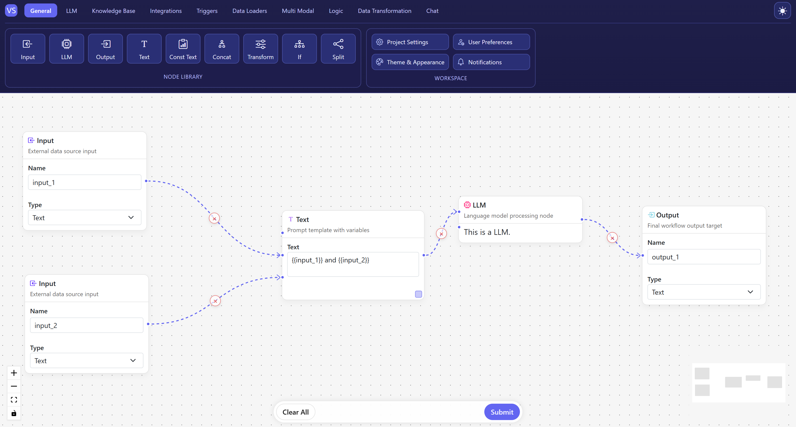
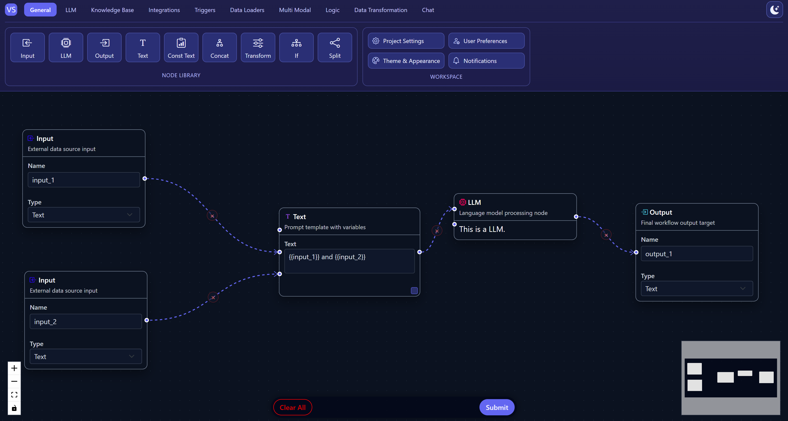

# Frontend technical assessment

A React application that implements a visual pipeline / workflow editor using [React Flow](https://reactflow.dev/). You can drag nodes from a toolbar, connect them on the canvas, and submit the graph.

## Screenshots

**Light mode**



**Dark mode**



## Prerequisites

- [Node.js](https://nodejs.org/) (LTS recommended)
- npm (comes with Node.js)

## Run locally

From the repository root:

```bash
cd frontend
npm install
npm start
```

The dev server runs at [http://localhost:3000](http://localhost:3000).

## Scripts (in `frontend/`)

| Command        | Description              |
|----------------|--------------------------|
| `npm start`    | Development server       |
| `npm run build`| Production build to `build/` |
| `npm test`     | Run tests (watch mode)   |

## Project layout

- **`frontend/`** — Create React App project; main UI, nodes, edges, and state live under `frontend/src/`.

## Git: Markdown files

This repo’s `.gitignore` ignores all `*.md` files except `README.md`, so local notes and walkthrough scripts stay out of version control unless you rename or adjust the ignore rules.
